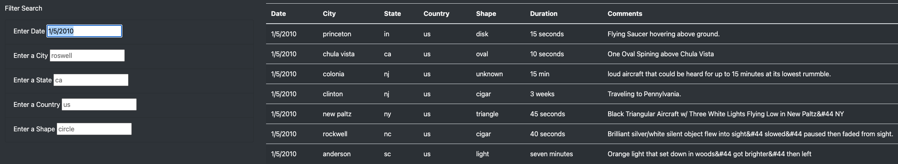
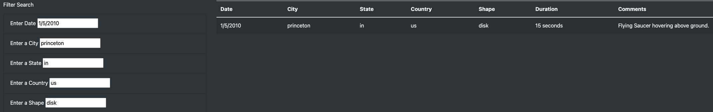

# UFOs
## Overview of the analysis
### Purpose
The purpose of this project is to update Dana's webpage that was created in Module 11 by adding table filters for the city, state, country, and shape so it would provide a more comprehensive analysis of UFO sightings.

## Results
There are filters for the date, city, state, country, and shape. You can filter for a criterion or multiple criteria at the same time. For example, if you want to search for all sightings that happened on 1/5/2010, you can simply enter 1/5/2010 on the date filter as shown on the first image. If you want to search for the specific sighting, you can enter all the criteria as shown on the second image. 

## Summary
-The drawback of this webpage is that it lacks visualization and does not provide the detailed information for each UFO sighting.  

-I would recommend to add the images of UFO sightings, also the link to the related articles if available. In addition to the shape and comments, the images and articles would provide the users a more details. I would also recommend to include the map to point each sighting location, which will help visualize areas with frequent UFO sightings.
